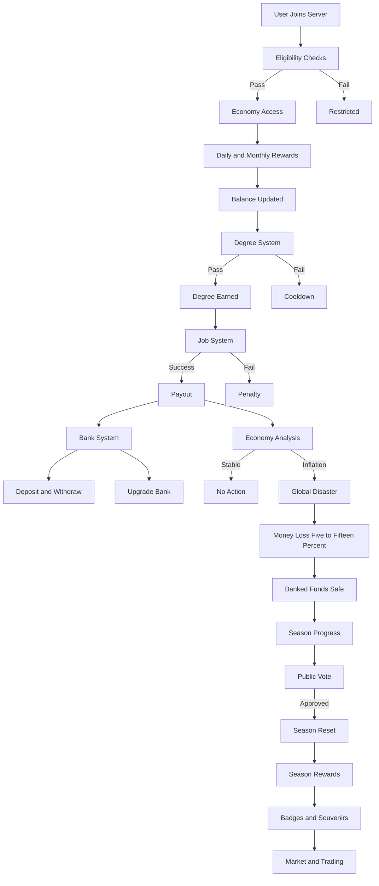
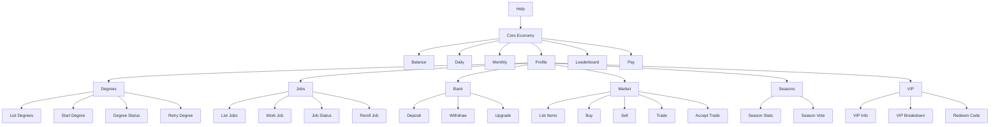

# 💰 Econera

**Econera** is a **skill-based, season-driven Discord economy bot** focused on fairness, strategy, and long-term progression — not pay-to-win gameplay.

It blends **knowledge systems, economy simulation, risk management, and collectibles** into a controlled fictional economy.


## 🧠 Design Philosophy

* **Skill > Money**
* **Time > Luck**
* **VIP = Convenience, not power**
* **No real-world monetary value**
* **Economy controlled via sinks & global events**
* **All admin actions logged**


## 🏗️ Core Systems

* Fictional in-bot currency
* Daily & monthly rewards
* Degree system (MCQ-based, earn once)
* Job system (degree-gated, skill checks)
* Bank system (disaster protection, heavy money sinks)
* Global disaster events (inflation control)
* Seasons with public reset voting
* Tradable collectibles (badges & souvenirs)
* VIP 2.0 (quality-of-life + protection)


## 🌍 Master System Flowchart




## 👑 VIP 2.0 Overview

VIP in Econera provides **comfort, protection, and flexibility**, never domination.

### VIP Benefits

* +25% daily & monthly rewards
* +5–10% job payout (hard-capped)
* +1 protected bank slot
* Lower withdrawal fees
* 1 free bank deposit per day
* 20–30% reduced disaster loss
* 1 degree mercy token per season
* Shorter job cooldowns
* Cosmetic VIP badge & souvenirs

### VIP Does NOT

* Unlock exclusive jobs or degrees
* Bypass disasters
* Reduce Pay tax
* Grant unlimited protection


## 🧭 Command Flowchart




## 💸 Player Payments (Phase-0 Locked)

The **Pay** command allows player-to-player transfers with lightweight safety.

### Rules

* Flat **7% tax** (burned)
* Disabled during global disasters
* Same sender → receiver cooldown: **24 hours**

### Limits

* Non-VIP: 2 uses per day, max **1.5× daily reward**
* VIP: 3 uses per day, max **2× daily reward**

No AML logic yet — this will be added in later phases.


## 📜 Slash Commands

### Core Economy

```
/balance
/daily
/monthly
/profile
/leaderboard
/pay
```

### Degrees

```
/degrees
/degree start
/degree status
/degree retry
```

### Jobs

```
/jobs
/job work
/job status
/job reroll
```

### Bank

```
/bank
/bank deposit
/bank withdraw
/bank upgrade
```

### Market & Trading

```
/market
/market list
/market buy
/market sell
/market remove
/trade
/trade accept
```

### Seasons

```
/season
/season stats
/season vote
```

### VIP

```
/vip
/vip info
/vip breakdown
/redeem
```

### Admin

```
/admin event
/admin disaster
/admin grant
/admin logs
/admin economy
```


# 🧠 Econera — TODO (Implementation Roadmap)

This section tracks **actual development tasks**.
Focus: **stable MVP first, scalability later**.

Legend:

* [ ] Not started
* [x] Locked
* [~] Later


## 🔒 Locked Decisions

* [x] Name: Econera
* [x] Fictional economy only
* [x] No gambling
* [x] VIP = QoL
* [x] AML deferred
* [x] Pay Phase-0 rules


## 🏗️ Phase-0 Core Economy

### Users & Access

* [ ] Account age checks
* [ ] Server join age checks

### Balance

* [ ] Balance storage
* [ ] Balance command
* [ ] Leaderboard
* [ ] Profile

### Daily / Monthly

* [ ] Daily reward
* [ ] Monthly reward
* [ ] Cooldowns
* [ ] VIP bonus


## 🎓 Degree System

* [ ] Degree configs
* [ ] Question pools
* [ ] MCQ logic
* [ ] Cooldowns
* [ ] Earn-once enforcement


## 💼 Job System

* [ ] Job configs
* [ ] Job work logic
* [ ] Payouts
* [ ] Cooldowns


## 🏦 Bank System

* [ ] Bank accounts
* [ ] Protected storage
* [ ] Withdrawal fees
* [ ] Upgrade curve
* [ ] VIP perks


## 🌍 Global Disasters

* [ ] Economy metrics
* [ ] Disaster triggers
* [ ] Announcements
* [ ] Loss logic
* [ ] Disable Pay


## 🗳️ Seasons

* [ ] Season state
* [ ] Voting
* [ ] Reset logic
* [ ] Reward distribution


## 🎖️ Collectibles

* [ ] Badges
* [ ] Souvenirs


## 🔁 Market

* [ ] Listings
* [ ] Buy and sell
* [ ] Trade flow
* [ ] Listing fees


## 💸 Pay System

* [x] Seven percent flat tax
* [x] Daily limits
* [ ] Counters storage
* [ ] Cooldowns


## 👑 VIP

* [ ] Redeem codes
* [ ] Expiry
* [ ] Benefit enforcement


## 🧑‍💻 Admin

* [ ] Admin commands
* [ ] Logging
* [ ] Permissions


## 🛡️ Safety

* [ ] Disclaimer command
* [ ] Keyword filtering
* [ ] Cooldown persistence


## 🧩 Storage

* [ ] Choose backend
* [ ] User schema
* [ ] Backup plan


## 🚫 Not Now

* [~] AML dashboard
* [~] Progressive tax
* [~] Transfer graphs
* [~] Guilds


## 📌 Disclaimer

Econera uses a **fictional virtual economy**.
All currency, items, and collectibles have **no real-world monetary value**.

